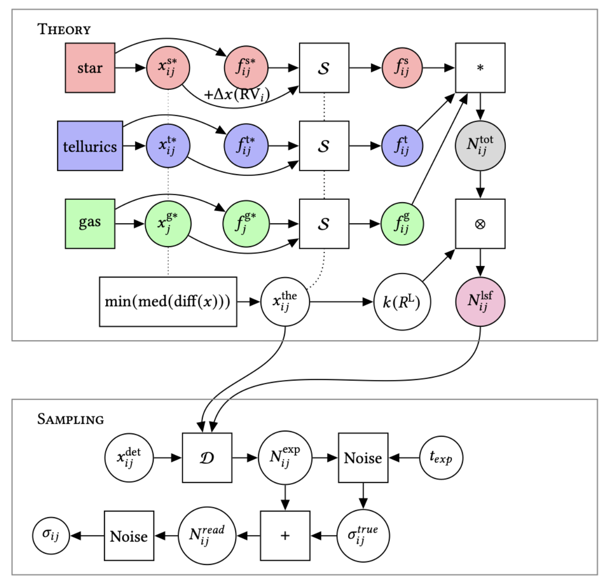

---

#### Abstract from Thesis

Extreme precision radial velocity (EPRV) extraction is fairly lengthy and variable process. Different instrumentation teams use different methods for calibration, flat field correction, and telluric removal. These methods are checked using these calibration methods. Compared to other more stochastic processes, stellar spectra are more static. As we approach the information limits of radial velocity, we need some verification that methods are saturating the information limits. To do so, we produce a method and python package that simulates stellar spectra as observed by some detector through the atmosphere. Users input parameters of the detector, select a source to be observed, give atmospheric parameters for tellurics, and simulate the observed spectra.

---

##### Graph of Simulator Workflow

---
